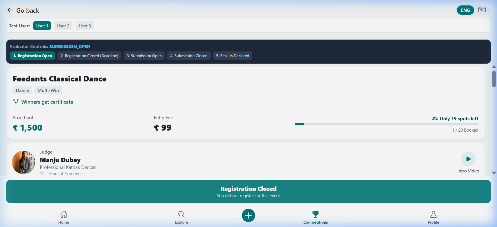
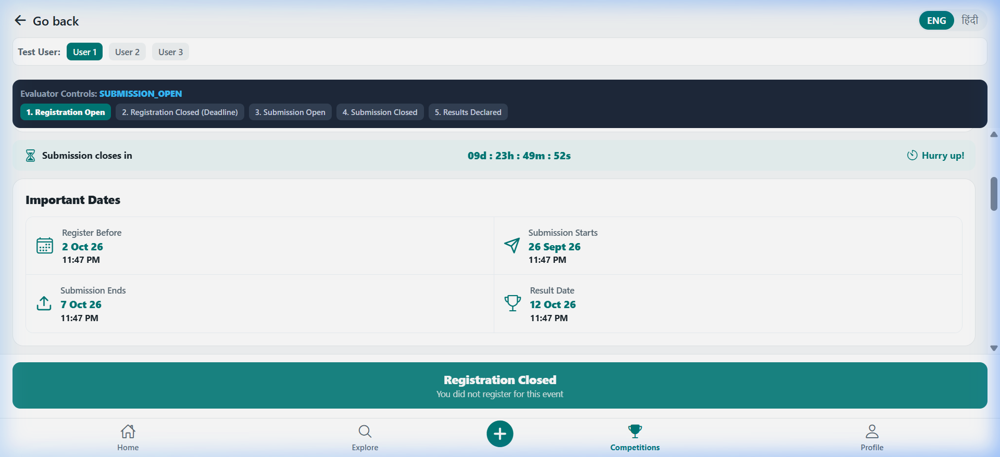
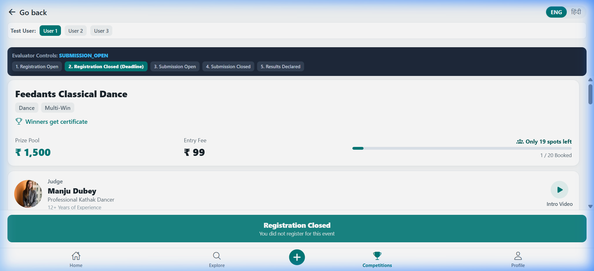
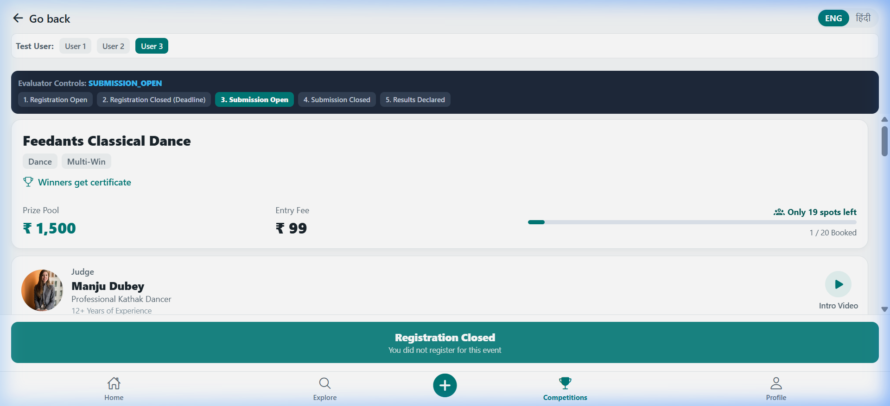
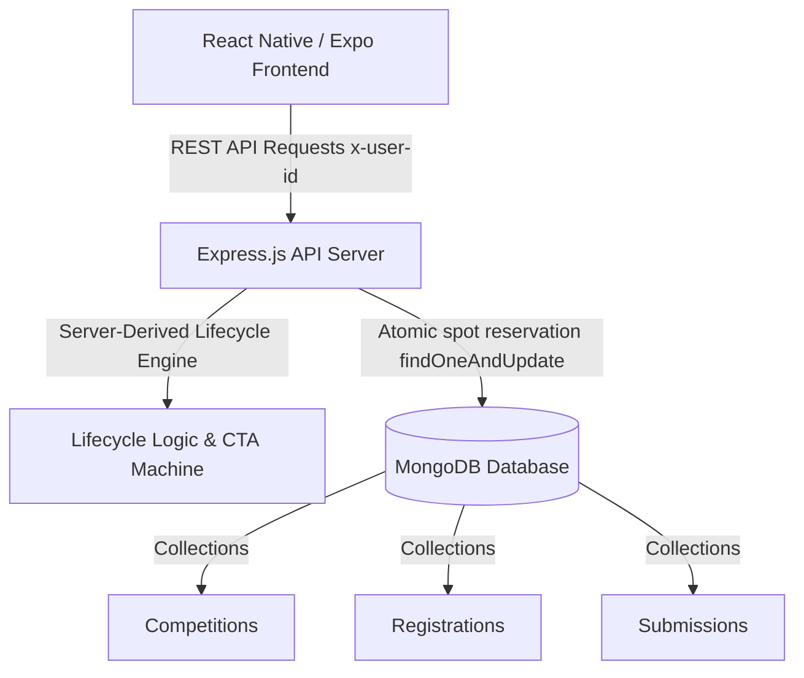
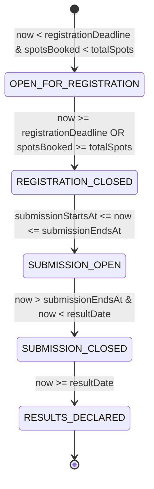
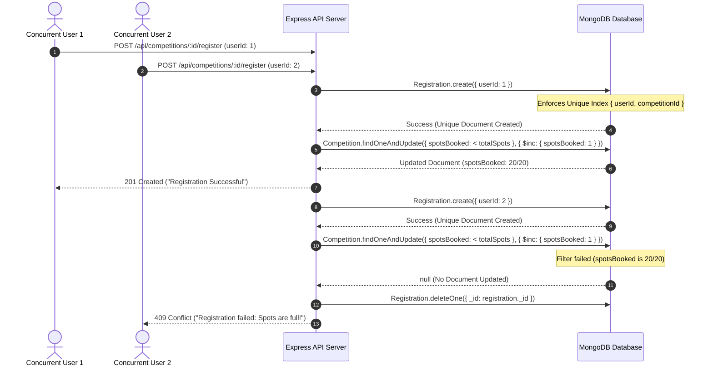

# Feedants Competition Details App

A submission-ready, full-stack **Competition Details** application built for the **Feedants Full Stack Development Internship Technical Assignment**.

This application features a **Node.js + Express + MongoDB/Mongoose** backend and a **React Native via Expo (Web + Mobile)** frontend. It faithfully replicates the reference design (`docs/Objective_Page.png`) with dynamic database-driven state management, atomic spot reservation concurrency handling, and server-derived lifecycle calculations.

---

## 🖼️ Visual Demo & Screenshots

### 1. Initial State (Registration Open - 1/20 Booked)


### 2. Full Competition Details View
| Header & Spots Progress | Judge, Dates, Winners & Rewards |
| :---: | :---: |
|  |  |

### 3. Server Lifecycle Phase Shifts
| Phase 2: Registration Closed | Phase 3: Submission Open |
| :---: | :---: |
|  |  |

---

## 🏗️ System Architecture & Data Flow



### 1. Server-Driven Lifecycle State Machine

The competition phase is **never calculated by client-side clocks**. On every request, the server computes the active phase based on server timestamps vs competition milestone dates:



| Phase Key | Condition | Bottom CTA Label | CTA State |
|---|---|---|---|
| `OPEN_FOR_REGISTRATION` | `now < registrationDeadline` AND `spotsBooked < totalSpots` | **Register** | Active (Teal) |
| `REGISTRATION_CLOSED` | `now >= registrationDeadline` OR `spotsBooked >= totalSpots` | **Registration Closed** | Muted Slate |
| `SUBMISSION_OPEN` | `submissionStartsAt <= now <= submissionEndsAt` (User registered) | **Upload Submission** | Active (Teal) |
| `SUBMISSION_CLOSED` | `now > submissionEndsAt` AND `now < resultDate` | **Submitted / Submission Closed** | Muted Slate |
| `RESULTS_DECLARED` | `now >= resultDate` | **Results Declared** | Leaderboard View |

---

### 2. Atomic Spot Reservation & Concurrency Sequence

To guarantee that two simultaneous requests can never both claim the last available spot, registration uses database-level atomic operations:



---

## 🗄️ Database Schemas (Mongoose)

### 1. `Competition` Schema
- `title`: String (required, trim)
- `tags`: [String]
- `certificateIncluded`: Boolean (default: true)
- `prizePool`: Number (required)
- `entryFee`: Number (required)
- `totalSpots`: Number (required)
- `spotsBooked`: Number (default: 0)
- `judge`: `{ name, title, experience, photoUrl, videoUrl }`
- `registrationDeadline`: Date (required)
- `submissionStartsAt`: Date (required)
- `submissionEndsAt`: Date (required)
- `resultDate`: Date (required)
- `rewards`: `[{ position, amount, iconType }]`
- `aboutText`: String
- `judgingParameters`: `[{ title, description, weightage }]`
- `rulesAndEligibility`: [String]
- `previousWinners`: `[{ name, rank, avatarUrl, videoUrl }]`

### 2. `Registration` Schema
- `userId`: String (required, indexed)
- `competitionId`: ObjectId (ref: `Competition`, required, indexed)
- `registeredAt`: Date (default: `Date.now`)
- `status`: String enum `['REGISTERED', 'CANCELLED']`
- **Compound Unique Index**: `{ userId: 1, competitionId: 1 }` *(Prevents duplicate registrations at database engine level)*

### 3. `Submission` Schema
- `userId`: String (required, indexed)
- `competitionId`: ObjectId (ref: `Competition`, required, indexed)
- `submittedAt`: Date (default: `Date.now`)
- `fileUrl`: String (required)
- `notes`: String
- `status`: String enum `['SUBMITTED', 'UNDER_REVIEW', 'ACCEPTED', 'REJECTED']`
- **Compound Unique Index**: `{ userId: 1, competitionId: 1 }`

---

## 📡 REST API Reference

| Method | Endpoint | Description | Request Headers / Body | Response Status |
|---|---|---|---|---|
| `GET` | `/api/competitions` | Fetch all competitions | None | `200 OK` |
| `GET` | `/api/competitions/:id` | Fetch competition details + server-derived phase | `x-user-id: <string>`, query `simulatedNow` | `200 OK`, `404 Not Found` |
| `POST` | `/api/competitions/:id/register` | Atomic user spot reservation | `{ userId: "<id>" }` | `201 Created`, `400 Bad Request`, `409 Conflict` |
| `POST` | `/api/competitions/:id/submit` | Upload competition entry | `{ userId: "<id>", fileUrl: "<url>", notes: "..." }` | `201 Created`, `400 Bad Request`, `403 Forbidden` |
| `POST` | `/api/seed` | Seed/reset sample competition | None | `200 OK` |
| `POST` | `/api/competitions/:id/set-spots-left` | Demo endpoint: set spots remaining | `{ spotsRemaining: 1 }` | `200 OK` |

---

## 🚀 Quick Start & Installation

### Prerequisites
- **Node.js**: v18.x or v20.x installed.
- **Database Connection Behavior**:
  - Connects to local MongoDB at `mongodb://127.0.0.1:27017/feedants_competition` or MongoDB Atlas via `MONGODB_URI`.
  - If `MONGODB_URI` is missing or local Mongo is unreachable, `db.js` logs a clear warning and initializes an embedded in-memory database (`MongoMemoryServer`).
  - *Note:* In-memory mode enables standalone execution without manual database installation, but **in-memory data will not persist across server restarts**.

---

### 1. Backend Setup

```bash
cd backend
npm install
```

#### Environment Variables (`backend/.env`)
Create a `.env` file in the `backend/` directory (see `.env.example`):
```env
PORT=5000
MONGODB_URI=mongodb://127.0.0.1:27017/feedants_competition
NODE_ENV=development
ENABLE_DEMO_CONTROLS=true
```

> ⚠️ **Note on `ENABLE_DEMO_CONTROLS`**:
> - In this take-home demo, `ENABLE_DEMO_CONTROLS=true` allows the server to process simulated date offsets sent by the Evaluator Controls UI.
> - **In production, `ENABLE_DEMO_CONTROLS` MUST be set to `false` (or omitted)** so the server strictly ignores client-sent timestamps and relies exclusively on the authoritative server system clock.

#### Start Backend Server
```bash
npm start
# or development mode with auto-reload
npm run dev
```

---

### 2. Frontend Setup (Expo Web + Mobile)

```bash
cd mobile
npm install
```

#### Environment Variables (`mobile/.env`)
Create a `.env` file in the `mobile/` directory (see `.env.example`):
```env
EXPO_PUBLIC_API_URL=http://localhost:5000/api
```

#### Run Web Browser Preview
```bash
npx expo start --web
```
Open **`http://localhost:8081`** in your web browser.

#### Run on Physical Mobile Device (Expo Go)
1. Install **Expo Go** on your iOS or Android phone.
2. Update `mobile/.env` with your computer's LAN IP address:
   ```env
   EXPO_PUBLIC_API_URL=http://192.168.1.3:5000/api
   ```
3. Ensure phone and computer are on the same Wi-Fi network, then start Expo:
   ```bash
   npx expo start
   ```
4. Scan the QR code using Expo Go (Android) or Camera app (iOS).

---

## 🧪 Automated Concurrency & Phase Test Suite

This repository includes custom Node.js test scripts to empirically verify system performance:

```bash
# 1. Run Concurrency Test (Simulates 30 simultaneous requests for 5 remaining spots & duplicate race conditions)
node backend/scripts/concurrency-test.js

# 2. Run Evaluator Phase Presets Test (Verifies all 5 server-derived lifecycle phases)
node backend/scripts/test-phase-presets.js

# 3. Run End-to-End Demo Script Verification
node backend/scripts/verify-demo-script.js
```

---

## 📝 Engineering Decisions & Production Trade-offs

### 1. Insert-Then-Increment Concurrency Model
- **Implementation**: Registration creates the unique `Registration` record first (`Registration.create`), enforcing database-level unique constraints. Then, an atomic `findOneAndUpdate` with `{ spotsBooked: { $lt: totalSpots } }` increments the booked count. If spots were full, the registration document is deleted and `409 Conflict` is returned.
- **Trade-off & Production Improvement**: In a single-node setup without multi-document transactions, a process crash in the exact microsecond between insertion and increment could leave an uncounted registration. **In production, both operations would be wrapped inside a MongoDB multi-document ACID transaction (`session.withTransaction`) on a replica set (such as MongoDB Atlas).**

### 2. High-Scale Concurrency & Production Readiness
- **Redis Caching & Distributed Locks**: For scaling to thousands of concurrent registrations per second, Redis atomic counters (`DECRBY spots_remaining`) and Redlock distributed locking would be placed ahead of MongoDB to handle traffic spikes.
- **Payment Gateway Checkout Reservation**: Integrate **Razorpay / Stripe** webhooks with temporary 10-minute spot holds during checkout before incrementing `spotsBooked`.
- **Media Storage**: Replace raw URL inputs with AWS S3 / Cloudinary presigned upload URLs for direct client-to-cloud video upload.
